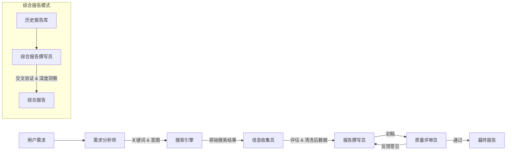

# 此项目技术栈与架构深度分析 (Technical Stack Analysis)

本文档旨在对 AI 研究报告生成系统进行深入的技术复盘、架构分析及未来演进规划。

---

## 🏗️ 1. 系统架构设计

本项目采用 **多 Agent 流水线 (Multi-Agent Pipeline)** 架构，通过分工明确的智能体协作完成复杂任务，并通过组合配置文件统一管理 Agent、工具与步骤编排。

### 1.1 核心工作流

### 1.2 模块化设计
*   **Agent 层 (`agents.py`)**: 封装了 Prompt 工程和 LLM 调用逻辑，每个 Agent 独立配置。
*   **LLM 抽象层 (`llm_providers.py`)**: 实现了 Provider 模式，统一了 DeepSeek, GLM, OpenRouter 的接口，支持自动回退和错误处理。
*   **工具层**:
    *   `search_engine.py`: 适配 Tavily (云端) 和 SearXNG (自建) 两种搜索后端。
    *   `document_parser.py`: 支持 Markdown, PDF, Word 的统一解析接口。
*   **组合配置层 (`config/pipeline.json`, `pipeline_factory.py`)**: 以配置驱动方式定义 agents/tools/pipeline，并在工厂中统一实例化，支持快速切换方案。
*   **表现层 (`gui_app.py`)**: 采用 wxPython 构建，通过后台线程 (`threading`) + 消息队列 (`wx.CallAfter`) 实现了 UI 与业务逻辑的解耦，保证界面响应流畅。

---

## 🛠️ 2. 关键技术栈

| 类别 | 技术/库 | 选型理由 |
| :--- | :--- | :--- |
| **编程语言** | Python 3.8+ | AI 生态极其丰富，开发效率高。 |
| **GUI 框架** | **wxPython** | 原生外观，比 Tkinter 美观，比 PyQt 轻量且开源协议友好，适合 Windows 桌面应用。 |
| **大模型 API** | **DeepSeek** (主力) | 推理能力强 (DeepSeek-Reasoner)，成本极低，适合大规模文本生成。 |
| | **Zhipu GLM-4** (辅助) | 中文语义理解优秀，工具调用能力强，用作 DeepSeek 的备份。 |
| **搜索引擎** | **Tavily** | 专为 AI Agent 设计的搜索 API，返回结果清洗度高。 |
| | **SearXNG** | 开源隐私保护搜索引擎，支持本地部署，无 Token 成本。 |
| **并发处理** | `threading` | 处理 I/O 密集型任务（网络请求），保持 GUI 响应。 |
| **文档处理** | `pathlib`, `json` | 标准库足以处理文本文档和元数据管理。 |

---

## 📅 3. 实施路径回顾

### Phase 1: 核心 CLI 原型
*   实现了基础的 Agent 类和流水线逻辑。
*   集成了 DeepSeek API 和 Tavily 搜索。

### Phase 2: GUI 与多任务
*   引入 wxPython 重构界面。
*   实现了日志重定向 (`LogRedirector`)，将控制台输出实时投射到 GUI。
*   添加了多线程任务管理，支持停止和多开。

### Phase 3: 综合报告与知识整合
*   新增 `ComprehensiveReportWriter`，引入 RAG 的雏形思想。
*   实现了报告的向量化检索前置步骤（目前基于关键词和元数据）。
*   实现了跨文档的信息交叉验证和矛盾检测算法。

### Phase 4: 多模型与配置化 (Current)
*   重构 `llm_providers.py`，支持多供应商热切换。
*   完成了配置文件的 GUI 可视化编辑。

---

## 🔭 4. 缺陷分析与演进规划 (Roadmap)

### 4.1 当前系统的局限性
1.  **知识库缺乏**: 每次任务都是从公网重新搜索，无法积累历史知识，且容易受搜索结果时效性影响。
2.  **上下文窗口限制**: 面对超长文档或大量历史报告时，依赖简单的截断策略，可能丢失细节。
3.  **多模态能力弱**: 下前仅支持文本，无法理解或生成图表。

### 4.2 下一代架构：RAG 知识库增强 (Phase 5 建议)

为了解决"缺乏自有知识库"的痛点，建议引入 **RAG (检索增强生成)** 体系。

#### 4.2.1 建设方案 ("点"与"面"结合)

*   **数据源 (面)**:
    *   **存量报告**: 将 `reports/` 下所有历史 Markdown 切片入库。
    *   **外部知识**: 定期抓取行业白皮书 (PDF)、关注的 RSS 源，进行结构化处理。
    *   **元数据**: 建立严格的 Schema (主题、时间、可信度、来源)，用于过滤。

*   **索引策略 (点)**:
    *   **混合检索 (Hybrid Search)**: 结合 **BM25 关键词检索** (精准匹配专有名词) + **Embedding 向量检索** (语义匹配)。
    *   **向量库**: 推荐使用 **Qdrant** 或 **Chroma** (轻量级，易集成)。
    *   **Rerank (重排序)**: 在检索回来的 Top-50 结果后，接一个 Cross-Encoder 模型 (如 `bge-reranker`) 进行精排，大幅提升准确率。

#### 4.2.2 推荐技术栈演进

| 模块 | 推荐选型 | 说明 |
| :--- | :--- | :--- |
| **Embedding** | `BGE-M3` (本地/API) | 目前中文语义表达最强的开源嵌入模型之一。 |
| **Vector DB** | **Qdrant** | Rust 编写，高性能，支持丰富的过滤条件，有 Python 客户端。 |
| **Orchestration** | **LangChain** 或 **LlamaIndex** | 引入专业框架管理 RAG 的 chunking 和 retrieval 流程，替代手写逻辑。 |
| **Text Splitter** | `RecursiveCharacterTextSplitter` | 智能按段落、标题分割，保留语义完整性。 |

### 4.3 具体的 RAG 改造步骤

1.  **数据清洗**: 编写脚本，将现有 Markdown 报告按章节切分，清洗掉无用的格式符号。
2.  **向量化**: 使用 Embedding 模型将切片转为向量，存入 Qdrant。
3.  **检索增强**: 在 `InformationCollector` Agent 中增加一路数据源——"本地知识库"。
4.  **生成融合**: 让 Agent 优先引用本地高可信知识，缺失部分再通过联网搜索补充。

通过引入 RAG，系统将从一个单纯的"搜索引擎接口"进化为具备"长期记忆"和"领域专精"的智能研究助理。
