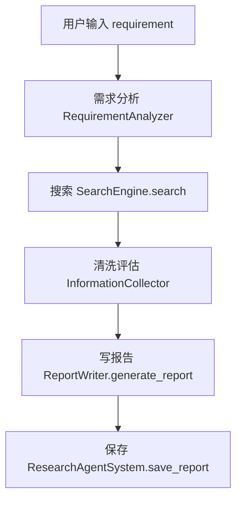
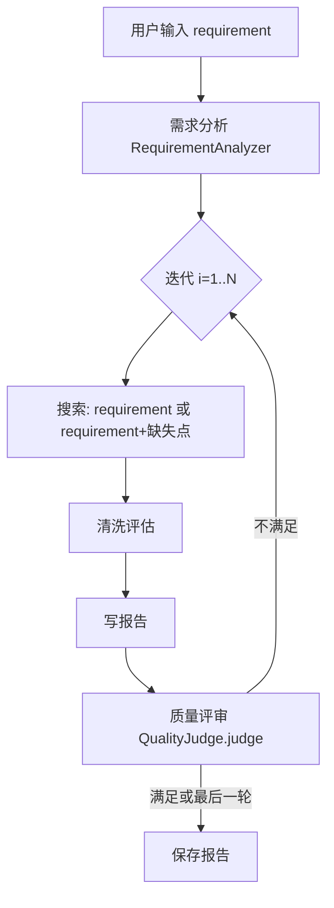

# 项目数据传递逻辑说明（中文）

本文档说明本项目从「用户输入」到「搜索 → 信息清洗 → 报告生成 → 保存/索引」的端到端数据流，以及 CLI/GUI 两条执行路径的关键数据结构与传递点。

---

## 1. 核心概念与数据结构

### 1.1 三类“配置数据”

1) **运行时配置（非密钥，集中管理）**
- 文件：`config/runtime.json`
- 内容：搜索参数、Agent 的 provider/model/use_reasoner、Provider 能力与模型兼容性规则等。

2) **环境变量（密钥与基础 URL）**
- 文件：`.env`（由 `dotenv` 加载）
- 内容：`*_API_KEY`、`*_BASE_URL` 等敏感信息（以及少量必要开关可覆写 runtime.json 的默认值）。

3) **运行时配置加载器**
- 文件：`runtime_config.py`
- 入口函数：`load_runtime_config()` / `save_runtime_config()`
- 作用：统一读取/写入 `config/runtime.json`，并提供 `get_nested()`、`parse_bool()` 等工具。

### 1.2 统一的“系统时间”（北京时间）

- 文件：`time_utils.py`
- 入口函数：`beijing_now_str(fmt="%Y-%m-%d %H:%M:%S")`
- 作用：生成北京时间字符串，用于注入到每个 Agent 的 system prompt（尤其对相对时间表达的换算有意义）。

### 1.3 贯穿全流程的上下文（context）

由 `ResearchAgentSystem` 维护一个上下文字典，用于在完整模式下跨迭代累积信息：

- `original_requirement`：原始用户需求
- `search_history`：每轮的搜索关键词、结果摘要等
- `collected_data`：信息收集员筛选/抽取出的“有效来源”结构化数据
- `previous_reports`：历史报告文本（用于综合/迭代写作）
- `missing_aspects`：质量评审指出的缺失点
- `improvement_suggestions`：质量评审给出的改进建议

此数据结构在 `main.py` 的 `ResearchAgentSystem.__init__` 初始化，并在 `process_requirement()` 的迭代过程中不断更新。

---

## 2. LLM 调用链路（所有 Agent 通用）

### 2.1 调用链路

数据从“业务 prompt”到“模型响应”的传递链路如下：

1) 具体 Agent 方法构造 `user_message`（例如：需求分析、批量评估、写报告）
2) `BaseAgent.call_llm(user_message, temperature=...)`
3) `LLMProviderManager.call_llm(provider_name, messages, model, use_reasoner, temperature, **kwargs)`
4) 具体 Provider（DeepSeek / Zhipu(GLM) / OpenRouter）使用 OpenAI SDK 的 Chat Completions 接口发起请求

关键文件：
- `agents.py`：`BaseAgent` 负责组装 messages，并将 `system_datetime` 注入到 system prompt 头部。
- `llm_providers.py`：ProviderManager 负责按 provider 选择具体 provider 实例，并调用 `provider.call(...)`。

### 2.2 能力协商（参数过滤）

不同供应商/不同路由模型对参数支持不完全一致。项目使用“能力协商”在发送请求前过滤不兼容参数：

- 规则来源：`config/runtime.json` 的 `providers.*.capabilities` 与 `providers.*.model_overrides`
- 行为：例如 OpenRouter 下 `z-ai/*` 可能不接受 `temperature`，则会自动不发送 `temperature` 字段，避免 `Invalid API parameter`

这使得未来新增更多供应商/模型时，可通过修改 runtime.json 来声明兼容性，而不必在业务代码里散落特判。

---

## 3. 搜索链路（关键词 → 搜索结果 → 内容补全）

### 3.1 关键词生成（需求分析师）

- 文件：`agents.py` 的 `RequirementAnalyzer.analyze()`
- 输入：`requirement`（用户需求字符串）
- 输出（逻辑期望）：包含 `keywords/search_keywords/main_topic/understanding/time_range` 等字段的 dict（若 JSON 解析失败会降级为正则/分词提取）。

提示词来源：`agent_prompts.py` 中的 `REQUIREMENT_ANALYZER_PROMPT`
- 已明确：系统会在提示词开头注入“当前时间（北京时间）”，用于把“近三年/截至目前”等相对时间换算成具体年份范围。

### 3.2 搜索引擎（SearchEngine）

- 文件：`search_engine.py`
- 入口：`SearchEngine.search(keywords: List[str]) -> List[Dict[str,str]]`
- 关键行为：
  - 并发：只取前 3 个关键词并发请求
  - 去重与优先：对结果进行去重，并对权威来源做优先排序（若启用）
  - 智能截取：最终截取到 `MAX_SEARCH_RESULTS`

### 3.3 网页/文档内容补全（fetch_content）

当搜索结果自带摘要较短时，会尝试抓取全文补全：

- 文件：`search_engine.py`
- 入口：`fetch_content(url: str) -> str`
- 关键行为：
  - HTML：BeautifulSoup 抽取纯文本
  - PDF：按 `Content-Type` 或 `.pdf` 后缀走 `DocumentParser.parse_pdf_from_bytes()` 提取文本
  - 缓存：使用 `_content_cache` 缓存 URL 抓取结果，避免跨关键词重复抓取

---

## 4. 信息清洗（搜索结果 → 结构化“有效来源”）

### 4.1 批量评估与并发

- 文件：`agents.py`
- 入口：`InformationCollector.evaluate_and_clean(search_results, requirement, batch_size=5)`
- 数据流：
  1) 将搜索结果按 `batch_size` 分批
  2) 根据 `MAX_CONCURRENT_EVALUATIONS` 并发或串行评估
  3) 每批拼接 prompt，要求模型“只返回 JSON”
  4) 解析 JSON 得到 `valid_sources` 列表并汇总

### 4.2 严格 JSON 解析策略

解析函数：`InformationCollector._parse_evaluation_response()`

- 当 JSON 解析失败时：该批次直接返回空列表（不会用“降级解析”去猜测），避免错误格式污染下游报告写作。

---

## 5. 报告生成与迭代（完整模式）

项目支持两种模式：

### 5.1 快速模式（quick）

核心链路（单轮）：

特点：
- 一次搜索一次写作，速度快
- 如果开启 `SKIP_EVALUATION`，会跳过“信息收集员评估”，直接用搜索结果前若干条作为“来源”

### 5.2 完整模式（full，多轮迭代）

核心链路（多轮）：

关键数据传递点：
- 质量评审输出的 `missing_aspects/improvement_suggestions` 会被写入 `context`，用于下一轮的“搜索关键词扩展”与“报告 prompt 增量写作”。

---

## 6. 保存、元数据、索引与历史检索

### 6.1 报告文件

- 保存位置：`reports/`
- 主报告：`reports/<主题>_<时间戳>.md`

保存入口：
- CLI/GUI 单篇报告统一走：`ResearchAgentSystem.save_report(...)`

### 6.2 元数据与索引

保存时会额外生成并更新：

- 元数据文件：`reports/<md同名>.json`
  - 由 `ReportMetadata` 写入（记录标题、时间、关键词、摘要等）
- 索引文件：`reports/.index.json`
  - 由 `ReportIndex` 维护（用于快速搜索/列表展示）

CLI 历史检索脚本：
- `report_search.py`：通过 `ReportIndex.search()` 在索引里查找历史报告

注意：
- “综合报告”（多篇整合）在 GUI 的实现路径中通常是直接写入一个 `综合报告_*.md` 并打开，未必会像单篇报告那样写入元数据/更新索引（取决于调用路径是否复用 `save_report()`）。

---

## 7. GUI 路径：界面 → 后台线程 → 调用核心流程

### 7.1 单篇报告生成（GUI）

- 文件：`gui_app.py`
- 核心机制：
  - GUI 点击“开始生成”后启动 `ResearchWorker` 后台线程
  - 线程内创建 `ResearchAgentSystem` 并调用 `quick_search()` 或 `process_requirement()`
  - 完成后调用 `save_report(auto_open=True)`，自动打开 Markdown

### 7.2 综合报告（GUI）

- 文件：`gui_app.py` + `agents.py` 的 `ComprehensiveReportWriter`
- 数据流：
  1) 用户在界面选择多个历史报告
  2) 后台读取每个报告的正文与 metadata（若存在）
  3) 将报告列表传入 `ComprehensiveReportWriter.analyze_and_integrate(...)`
  4) 生成综合 Markdown 并保存/打开

### 7.3 日志与进度的“线程隔离”

- GUI 为多任务并发输出做了日志路由：
  - 将不同线程的 stdout/stderr 输出路由到各自的日志窗口，避免多任务日志互相串台。

---

## 8. 常见问题（与数据流相关）

1) **为什么 GUI 配了模型但运行时没生效？**
- 解决思路：确保“唯一事实来源”是 `config/runtime.json`，GUI 保存也写入 runtime.json；Agent 运行时从 `config.py` 读取并传入 BaseAgent。

2) **为什么某些站点抓取不到内容（403/反爬）？**
- 现象：搜索能搜到标题，但抓正文经常失败。
- 解决思路：对高频反爬域名跳过全文抓取，保留搜索摘要；或换用可执行 JS 的抓取方案（本项目默认不做）。

3) **为什么信息收集员有时“整批跳过”？**
- 原因：该批次的 LLM 返回不是严格 JSON，解析失败即丢弃。
- 建议：降低 prompt 复杂度、控制 `CONTENT_EXTRACT_LENGTH`，并确保模型/路由支持所用参数。

